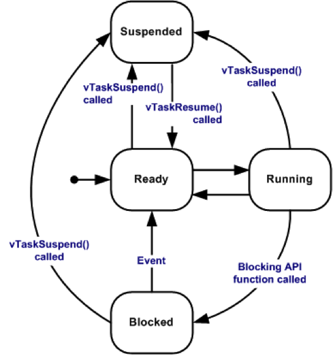
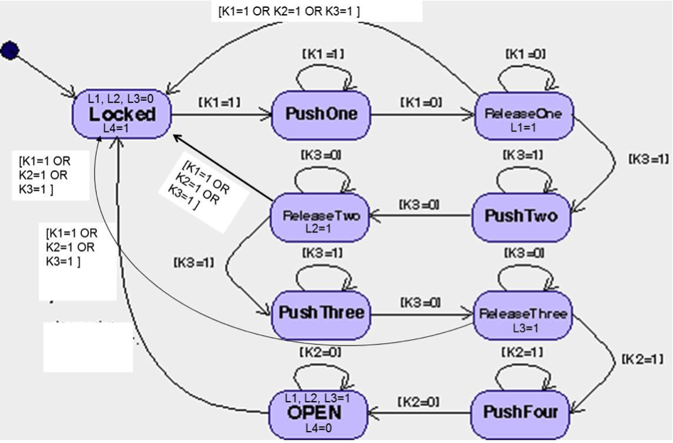
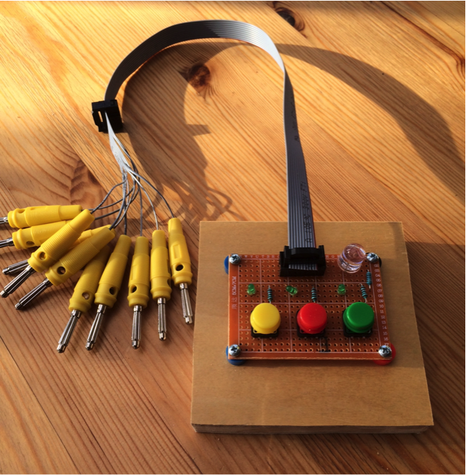
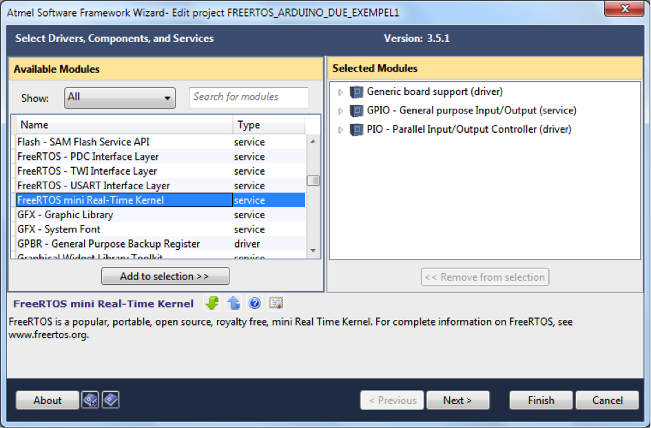
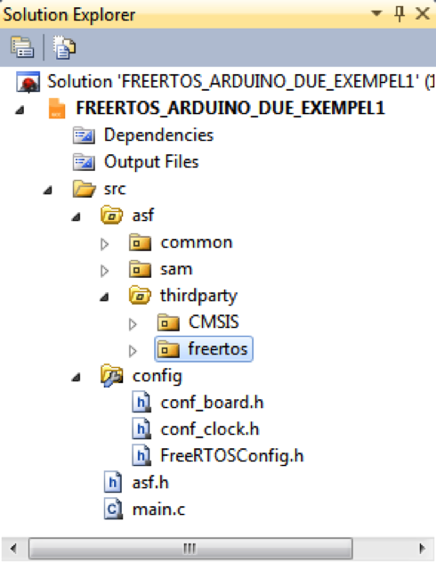

Uppgift 1501f
======
Programmering med tid i labbsalen  
_Ulrik Eklund, 2015-11-11_

Syfte med uppgiften:
------
Den här laborationen handlar om man

- konstruera programvara i C som implementerar en tillståndsmaskin.
- hur man använder realtidsoperativsystemet [FreeRTOS](http://www.freertos.org) med Arduino Due.

Teori om realtidsoperativsystem
------
### Hur man använder tasks (processer) i FreeRTOS
En task är ett litet program som är programmerat för kunna köras oberoende av andra tasks. Varje task exekveras inom sin egen kontext oberoende av andra tasks i systemet. Endast en task kan exekveras vid en viss tidpunkt och RTOS-schemaläggaren ser till att den task med högst prioritet exekveras.

En task kan existera i följande tillstånd:

- Running: När en task körs och utnyttjar processorn.
- Ready: Task som inte exekveras eftersom en annan task med samma eller högre prioritet körs (den andra tasken är i i Running-tillståndet).
- Blocked: En task som väntar på en händelse, till exempel på att en hardvaruresurs blir ledig, befinner sig i detta tillstånd.
- Suspended: En task går till eller från suspended tillstånd genom anrop av vTaskSuspend() och xTaskResume().



### Den task som skall exekveras periodiskt
Varje periodisk task definieras som en egen funktion.

```c
void vTaskCode(void *pvParameters)
/* Task som ska skapas. */
{
    while(1)
    {
        /* kod skrivs här. */
        /* vänta en förutbestämd tid */
    }
}
```

### Skapa tasken i `main.c` så att operativsystemet kan köra den
Innan någon task kan köras måste den skapas så att operativsystemet kan hålla reda på vilka olika tasks som finns (i den här labben ska det köras två task parallellt). Skapandet av varje task görs med API-funktionsprototypen `xTaskCreate()` i FreeRTOS.  Funktionsprototypen gör det möjligt att skapa en task och lägga till den i listan över tasks som är redo att köra.

```c
int main(void)
{
    static unsigned char ucParameterToPass;
    xTaskHandle xHandle = NULL;

    xTaskCreate(vTaskCode, "NAME", STACK_SIZE, &ucParameterToPass, tskIDLE_PRIORITY, &xHandle); /* Skapa en task, lagring av handle. */

    configASSERT(xHandle); /* Kolla att taken skapats som det är tänkt */
}
```

- `pvTaskCode` Pointer to the task entry function (den som defineriades i steget ovan). Tasks must be implemented to never return (i.e. a continuous loop).
`Name`	A descriptive name for the task. This is mainly used to facilitate debugging. Max length defined by `configMAX_TASK_NAME_LEN`.  
- `STACK_SIZE` The size of the task stack specified as the number of variables the stack can hold - not the number of bytes. For example, if the stack is 16 bits wide and usStackDepth is defined as 100, 200 bytes will be allocated for stack storage. The stack depth multiplied by the stack width must not exceed the maximum value that can be contained in a variable of type `size_t`.  
- `pvParameters` Pointer that will be used as the parameter for the task being created.  
- `uxPriority` The priority at which the task should run.  
- `pvCreatedTask` Used to pass back a handle by which the created task can be referenced (e.g. being suspended or deleted).

Krav för godkänt:
------
Ha genomfört följande labbmoment enligt denna handledning:

1. Laddat ner kodexempel på implementationer av FSM från github
2. Implementera en tillståndsmaskin som passerar alla tester i test-projektet
3. Skrivit kod och tester för initialisering och styrning de digitala I/O som behövs för att styra kodlåset.
4. Modifiera det befintliga projektet i samma kodrepo. Detta projekt skall innehålla två tasks:
    - En task som innehåller den testade tillståndsmasken och I/O-koden. Denna ska ha högst prioritet
    - En task som blinkar lysdioden
5. Koppla upp kodlåset mot lämpliga digitala I/O på Due-kortet
6. Köra programmet och spela in en video av fungerande lås, antingen som länk till ett eget youtube klipp eller som två videofiler (obs max 30 sec per video), uppladdad till It´s learning
7. Checka in kod + tester till ett centralt GIT-repo

Du visar upp för läraren för bedömning först när du är helt klar med steg 6.

Krav innan uppgiften
------
Om annan dator än labsalens dator används (t.ex. egen dator) måste följande program finnas installerat på den datorn:

- Atmel Studio 6.1 eller senare (finns endast för Windows). Obs att 7.0 inte har något terminalfösnter för att skriva ut testresultat.
- Github client eller TortoiseGit, helst med en kommandotolk (för andra datorer än Windows finns andra Git-klienter)
- Bossac.exe och tillhörande bat-fil
- Rekommenderas också att ha ett USB-minne för att lätt kunna flytta sitt lokala repo

Själva uppgiften
------
När du är färdig har du ett program som kör två olika processer parallellt, den första är mer komplicerad som läser knappar och styr kodlåset och den andra är enkel och bara blinkar lysdioden.  
Tillståndsmaskinen för den första processen tas fram i ett separat projekt med egna testfall. När den passerar testfallen infogas den in det andra projektet.

### Skapa ett personligt repo för denna programmeringsuppgift med hjälp av Git.  

Det finns ett centralt repo för kursen på github med webbadressen: 
<https://github.com/MalmoUniversity-DA264A/Task1501f> 

Du gör en fork från detta repot, och klonar det till din utvecklingsdator på samma sätt som i tidigare labbar. Sen jobbar  du vidare i ditt eget repo och gör en pull request mot kursrepot när du är klar.

### Programmering: Tillståndsmaskin för kodlåset

På föreläsningen gick vi igenom tre olika sätt att implementera en tillståndsmaskin. Du kan se exempel i en katalog i labbens repo.

1. Med en tabell som definierar tillstånd och övergångar
2. Med en nästlad case/switch och en stor if-sats i main.c
3. Med tillståndsmaskinen som en dold datatyp och där varje event definieras som en egen funktion

I alla tre exemplen exekveras tillståndsmaskinen i en oändlig loop i `main()`. Det kan vara vettigt att ha en fördröjning i den loopen så att tillståndsmaskinen exekverar med en viss förbestämd periodicitet (typ var 100 ms). Det enklaste är att lägga in en fördröjning i huvudloopen, det finns redan funktioner för delay-timern i `DelayFunctions.c` och `DelayFunctions.h` från tidigare labbar.  
Observera att man måste använda ASF Wizard under ASF menyn för att inkludera Atmels bibliotek för timern (TC) för att dessa ska fungera.

Det är samma tillståndsmaskin som i den förra Matlab-uppgiften. Diagrammet nedan visar hur den ser ut för en viss sekvens av knapptryckningar. _Vilken är sekvensen?_



I den föregående matlab-uppgiften identifierade du mängden X av tillstånd och mängden E av händelser. Dessa två mängder har du stor nytta av i denna uppgift, både för 

1. att välja vilket av de tre sätten du tänker använde, och när du sen ska 
2. fylla i tabellen, skriva case/switch-satserna eller definiera event-funktionerna.

Projektet `TestFSM` har som syfte att testa tillståndsmaskinen för kodlåset. _Programmeringen av den går att göra utan att bygga någon labbsetup förutom Due-kortet och går alltså att förbereda innan du kommer till labsalen._

Precis som i den förra uppgiften kan du definiera den rätta koden som en valfri sekvens med fyra knapptryckningar som får det elektroniska låset att öppnas, t.ex genom en fördefinerad array med fyra element. Men testerna i `TestFSM` testar bara en enda sekvens, den som syns i bilden. Att kunna ändra kod gör ju att villkoren för att gå mellan tillstånd ser olika ut beroende på vilken kod du väljer. _Påverkar det vilken metod du vill använda för att implementera tillståndsmaskinen?_

### Bygga labbsetup

Utrustning:

- Utvecklingskort Arduino Due
- USB-kabel
- Knappsats för kodlås (samma som i förra uppgiften)
- Anpassningskablar mellan knappsats och Due-kortet



Bilden ovan visar laborationsutrustningen med tre knappar, tre gröna (små) och en röd (stora) led.  
Anslutningar är via en flatkabel med 10 banankontakter, de borde vara markerade. Kontakterna har en tendens att flätas ihop, vänligen var mycket försiktig när du flätar upp dem. Om man tittar på kabeln med röda markeringen till vänster så är ordningen på kontakterna följande: 

Kontakt | Syfte
---|---
1 | Inte ansluten 
2 | GRND - ground 
3 | L4 – stor led som lyser rött 
4 | B3 – tredje knapp från vänster 
5 | L3 – tredje små grön led från vänster  
6 | B2 – knappen i mitten
7 | L2 – andra små grön led från vänster 
8 | B1 – första knapp från vänster 
9 | L1 – första små grön led från vänster 
10 | +5V – anslutningen till +3,5V

OBS! För att inte bränna Due-kortet så måste matningen till låset på banankontakt #10 göras med 3,3V oavsett vad som står på själv banankontakten!  
Det skiljer sig alltså mot förra uppgiften. Om ni har ett externt spänningsaggregat så behöver ni nog en gemensam jord.

Kontakterna #3-9 skall kopplas till de digitala in och utgångarna på Due-kortet. Det finns en kopplingssats för detta ändamål.  
Håll reda på vilka som är in- respektive utgångar så att det blir rätt när du programmerar portarna i Atmel-studio.

### Programmering: I/O-pinnarna

I den förra labben skrev ni ett Matlab-program som testar alla knappar och led-lampor. Skapa ett nytt Atmel-projekt (TestButtons) och skriv ett program som gör samma sak i C där ni skriver en c-fil och tillhörande h-fil med funktioner som initialiserar och styr I/O-pinnarna som behövs och med hjälp av dem testar alla knappar och led-lampor så att ni vet att ni har kopplat rätt.

### Programmering: Sätta samman allt för att styra kodlåset med hjälp av Arduino Due

1. Du ska nu använda dig av Atmel studio-projektet `ProjectCodeLockInC` i ert repo. Projektet ska innehålla kod från olika källor (dvs olika c och h-filer):
    - Den tillståndsmaskin med tillhörande definitioner och funktioner du skrivit och testat som behövs för att låset ska fungera korrekt.
    - Kod (c & h-filer) för I/O pinnarna som du redan skrivit och testat ovan.
    - Kod (c & h-filer) som använder sig av FreeRTOS. Du ska skapa två tasks, den första kör tillståndsmaskinen och ändrar utgångarna till kodlåset. Den andra blinkar den inbyggda lysdioden (PB27 = Due pin 13).
2. Använd ASF Wizard för att inkludera biblioteken för I/O-port och FreeRTOS.
3. Skriv en `main()` (i main.c) som startar de två tasks.

I första hand ska du skriva ett program som kan hantera den förutbestämda sekvensen för knapptryckningarna enligt tillståndsmaskinen ovan.  
Som extrauppgift kan du modifiera programmet så att du genom att ange sekvensen som en deklaration på ett enda ställe innan du kompilerar programmet. Blir det olika svårt beroende på vilken metod för att implementera tillståndsmaskinen som du valde?

#### ASF Wizard
Innan du börjar skriva kod behöver du lägga till några moduler till projektet via ASF. För att kunna använda sig av FreeRTOS måste man först importera källkoden till sitt projekt.  
Öppna ASF Wizard (Projekt->ASF Wizard) och lägg till FreeRTOS och de andra modulerna nedan till ditt projekt.

ASF module | Beskrivning
--- | ---  
Generic board support (driver) | Innehåller kretskort-specifika definitioner och prototypfunktioner, såsom kretskort initiering funktionen.
System Clock Control (service) | Modul för klockkontroll (SYSCLK). Erbjuder funktioner för åtkomst, konfiguration, aktivering och inaktivering av klockor.
GPIO – General purpuse Input/Output (service) | Tillhandahåller funktioner för att initiera I/O pinnar som ingång eller utgång.
Standard serial I/O (stdio) (driver) | Standard I/O hantering modul, vilken implementerar stdio seriellt gränssnitt på SAM-enheter.
PIO – Parallel Input/Output Controller (driver) | Denna modul kan hantera upp till 32 fullt programmerbara ingång/utgång pinnar.
PMC - Power Management Controller	 | Denna modul optimerar strömförbrukningen genom att kontrollera samtliga system- och användarperiferi klockor.
UART – Univ. Async Rec/Trans (driver) | UART kan användas för kommunikation och spårändamål.
FreeRTOS mini Real-Time Kernel (service) | Denna modul är FreeRTOS som är ett realtidsoperativsystem.
En lista med **Available Modules** dyker upp. Där ska du hitta `FreeRTOS mini Real-Time Kernel` och markera den. Klicka sedan på knappen Add to selection. Nu kommer du kunna se modulen i Selected Modules, under denna lista ser du alla moduler som kommer att finnas med i ditt projekt. Klicka sedan på Apply. Kryssa i rutan I accept the license agreement när det behövs och gå vidare.
De genererade filerna hamnar under `src/ASF`, till exempel så hamnar filerna för FreeRTOS under `src/ASF/thirdparty/freertos-7.3.0` (såvida Atmel inte har uppdaterat till en ny version)


Bilden nedan visar i vilka kataloger var källkoden  till FreeRTOS hamnar i projektet.
I Solution Explorer under katalogen (`src/ASF/thirdparty/freertos-7.3.0`) hamnar freertos-katalogen. Två andra filer skapas också men de ligger under katalogen config. Där skapas konfigurationsfilerna `FreeRTOSConfig.h` och `conf_clock.h`.


### Implementera RTOS tasks med tillståndsmaskinen

Skapa en ny c-fil för den första av de två tasks som ska köras. Denna c-fil innehåller följande funktion:

```c
void task_codeLock(void *pvParameters)
/**
 * This task will run the code lock and change the I/O
 */
{
    while(1)
    {
    	/* Insert your code for reading the buttons here */
    	/* Insert your code for the statemachine here */
    	/* Insert your code for controlling the code lock lamps here */
    	vTaskDelay(200); /* 200 millisecond delay */
    }
}
```
Tillståndsmaskinen kommer alltså att köras var 200 ms.

Glöm inte att inkludera nödvändiga h-filer (som ASF.h) för att funktionsansropen ska fungera!

Skapa också en h-fil som motsvarar denna c-fil och som du inkluderar i main.c och i c-filen du just skapat.  
h-filen behöver innehålla några definitioner också, utöver deklarationen av task_codeLock-funktionen:

```c
#define TASK_CODELOCK_STACK_SIZE		(2048/sizeof(portSTACK_TYPE))
#define TASK_CODELOCK_STACK_PRIORITY	(2)
```

### Skapa ytterligare en c-fil för den andra tasken 

```c
/**
 *  This tasks makes the on-board LED blink every second
 */
void task_led(void *pvParameters)
{
    TickType_t xLastWakeTime;
    const TickType_t xTimeIncrement = 500;

    xLastWakeTime = xTaskGetTickCount(); /* Initialise the xLastWakeTime variable with the current time. */
    while (i) {
        vTaskDelayUntil(&xLastWakeTime, xTimeIncrement); /* Wait for the next cycle. */
        gpio_toggle_pin(LED0_GPIO);
    }
}
```
`vTaskDelayUntil()` gör att lysdioden blinkar med precis 1 sekunds periodtid (tänd 500ms, släckt 500ms), den räknar alltså tiden från början av while-loppen inklusive tiden det tar att ställa om lysdioden.

_Du måste lista ut rätt `#define` för `LED0_GPIO` för att få lysdioden på Due-kortet att blinka_. Även för den här c-filen behövs det h-filer som du inkluderar i `main.c` och i c-filen du just skapat.  
h-filen för LED-tasken behöver också innehålla några definitioner också, utöver deklarationen av task_led-funktionen:

```c
#define TASK_LED_STACK_SIZE		(1024/sizeof(portSTACK_TYPE))
#define TASK_LED_STACK_PRIORITY		(tskIDLE_PRIORITY)
```

### Konfigurera FreeRTOS
För att kunna köra FreeRTOS smärtfritt måste det konfigureras i `FreeRTOSConfig.h`  
Enklast är att kopiera koden i appendixet sist i instruktionen, då det är rätt många parametrar att hålla reda på.

### Watchdog timer (WDT
Följande är hämtat från databladet för SAM3X8E:

> The Watchdog Timer (WDT) can be used to prevent system lock-up if the software becomes trapped in a deadlock. It restarts with initial values on processor reset.   
> After a Processor Reset, the value of WDV is 0xFFF, corresponding to the maximum value of the counter with the external reset generation enabled. **This means that a default Watchdog is running at reset, i.e., at power-up.** The user must either disable it if he does not expect to use it or must reprogram it to meet the maximum Watchdog period the application requires.   
> In normal operation, the user reloads the Watchdog at regular intervals before the timer underflow occurs, by writing the Control Register.

I klartext betyder det att om man inte gör något åt det så kommer processorn att göra en reset efter ett tag då WDT har räknat ner till noll. Om man inte behöver funktionen att detektera och förhindra låsning av programmet så kan man avaktivera WDT med följande funktion från ASF i början av sitt program: 

```c
void wdt_disable(void);
```

### Sätta samman allt i `main.c`
Tyvärr finns det en bug i FreeRTOS när det gäller namnet på varje task; kompilatorn i Atmel Studio antar att en textsträng är en unsigned char, medan FreeRTOS antar att den är signed. Därför behövs en explicit typecasting göras i varje anrop av xtaskCreate.

```c
/* defines, includes of the h-files for the tasks
 * and declarations go here
 */

int main(void)
{
    /* Initialise the Due board */
    sysclk_init();
    board_init();

    /* Initialise console UART */
    configure_console();

    /* Print demo information on the terminal*/
    printf("-- FreeRTOS Exemple – Tasks --\n\r");
    printf("-- %s\n\r", BOARD_NAME);
    printf("-- Compiled: %s %s --\n\r", __DATE__, __TIME__);

   /* Create the first task for running the code lock */
    if (xTaskCreate(task_codeLock, (const signed char * const) "codeLock", TASK_CODELOCK_STACK_SIZE, NULL, TASK_CODELOCK_STACK_PRIORITY, NULL) != pdPASS) {
        printf("Failed to create code lock task\r\n");
    }
            
    /* Create the second task with blinking LED */
    if (xTaskCreate(task_led, (const signed char * const) "Led", TASK_LED_STACK_SIZE, NULL, TASK_LED_STACK_PRIORITY, NULL) != pdPASS) {
        printf("Failed to create test led task\r\n");
    }

    /* Start the FreeRTOS scheduler running all tasks indefinitely*/
    vTaskStartScheduler();

    /* The program should only end up here if there isn’t enough memory to create the idle task */
}
```

### Köra det färdiga programmet

Kör programmet och spela in en video av fungerande lås, antingen som länk till youtube-klipp eller som videofiler (obs max 30 sec per video), uppladdad till It’s learning.

Nu har du klarat av all programmering som behövs (men det är lite kvar med själva inlämningen för att få godkänt).  
Visa gärna upp Due-kortet med låset för handledaren om du befinner dig i labbsalen. Glöm inte att committa det färdiga programmet med git på din dator.

Tänk på att du måste ange vilken metod du använt dig av för att implementera en tillståndsmaskin i C, t.ex. både som kommentar i din kod och som meddelande i din pull request.  

### Lagra arbetet på github och lämna in för bedömning

Om du är klar med all programmering är det vara dags att synka ditt lokala repo med det som du har på github. Det görs med en push tillbaka till github. Din gitklient är oftast så smart att den kommer ihåg varifrån man klonade repot, därför kan man oftast använda origin istället för den långa webbaddressen (<https://github.com/StudentNN/Task1501f.git>. 

Har du kommit så långt har du ett uppdaterat repo som du kan se på githubs webbsida. Nu ska du skicka in en begäran att ägaren till det gemensamma kursrepot ska titta på dina ändringar genom en pull request (steg 5 i Figur 3). Där anger du en rubrik (till exempel att du är klar med en viss uppgift), och fyller i en beskrivning av vad dina ändringar består av.

**Glöm inte att ange namnen alla som bidragit med att göra klart uppgiften!** Det går inte att komma i efterhand och påstå att du varit med om ditt namn inte finns med på originalinlämningen! I så fall får du göra en egen pull request efteråt.

Ulrik kommer att titta på alla som har lämnat in till fredag. Om du lämnar in senare kommer de att bedömas vid tentamen.

Appendix: Output från sitt program
======
Eftersom det inte finns någon naturlig bildskärm kopplad till Due-kortet måste man få ut saker som vanligtvis skulle skrivas på en terminal på annat sätt.

I `ConsoleFunctions.c` finns ett exempel hur man initierar att Due-kortet skriver på COM-porten på PC:n via USB-kabeln (`configure_console(void)`). Det gör det möjligt att använda terminalfönstret inifrån Atmel Studio som output för printf().  
Det finns dock ingen motsvarande h-fil, så den måste man skriva själv!

Man måste dessutom inkludera Atmels biblotek för seriell I/O med hjälp av ASF wizard i Atmel Studio. Parametrarna för terminalkommunikationen måste man ange i filen config/conf_uart_serial.h som genereras av ASF wizard när man inkluderar biblioteket. Enklast är att använda default-parametrarna genom att bara ta bort kommentarssymbolerna.

Terminalfönstret konkurrerar med Bossac om COM-porten så när man laddar ner sin binärfil till DUE-kortet måste terminalfönstret vara o-connectat.  
Så fort man laddat ner sin binärfil till Due så startar ju programmet och därför missar man utskriften innan man gjort connect igen. Gör connect och tryck på reset-knappen för att starta programmet om igen.

Appendix: FreeRTOSConfig.h
======
Följande fil finns också inkluderad i huvudkatalogen i git-repot och kan ersätta den som finns i Atmel-projektet i en underkatalog till ASF när du ska använda FreeRTOS.

```c
/**
 *
 * \file
 *
 * \brief Generic FreeRTOS peripheral control functions
 *
 *
 * Copyright (c) 2012 Atmel Corporation. All rights reserved.
 *
 * \asf_license_start
 *
 * \page License
 *
 * Redistribution and use in source and binary forms, with or without
 * modification, are permitted provided that the following conditions are met:
 *
 * 1. Redistributions of source code must retain the above copyright notice,
 *    this list of conditions and the following disclaimer.
 *
 * 2. Redistributions in binary form must reproduce the above copyright notice,
 *    this list of conditions and the following disclaimer in the documentation
 *    and/or other materials provided with the distribution.
 *
 * 3. The name of Atmel may not be used to endorse or promote products derived
 *    from this software without specific prior written permission.
 *
 * 4. This software may only be redistributed and used in connection with an
 *    Atmel microcontroller product.
 *
 * THIS SOFTWARE IS PROVIDED BY ATMEL "AS IS" AND ANY EXPRESS OR IMPLIED
 * WARRANTIES, INCLUDING, BUT NOT LIMITED TO, THE IMPLIED WARRANTIES OF
 * MERCHANTABILITY, FITNESS FOR A PARTICULAR PURPOSE AND NON-INFRINGEMENT ARE
 * EXPRESSLY AND SPECIFICALLY DISCLAIMED. IN NO EVENT SHALL ATMEL BE LIABLE FOR
 * ANY DIRECT, INDIRECT, INCIDENTAL, SPECIAL, EXEMPLARY, OR CONSEQUENTIAL
 * DAMAGES (INCLUDING, BUT NOT LIMITED TO, PROCUREMENT OF SUBSTITUTE GOODS
 * OR SERVICES; LOSS OF USE, DATA, OR PROFITS; OR BUSINESS INTERRUPTION)
 * HOWEVER CAUSED AND ON ANY THEORY OF LIABILITY, WHETHER IN CONTRACT,
 * STRICT LIABILITY, OR TORT (INCLUDING NEGLIGENCE OR OTHERWISE) ARISING IN
 * ANY WAY OUT OF THE USE OF THIS SOFTWARE, EVEN IF ADVISED OF THE
 * POSSIBILITY OF SUCH DAMAGE.
 *
 * \asf_license_stop
 *
 */

#ifndef FREERTOS_CONFIG_H
#define FREERTOS_CONFIG_H

/*-----------------------------------------------------------
 * Application specific definitions.
 *
 * These definitions should be adjusted for your particular hardware and
 * application requirements.
 *
 * THESE PARAMETERS ARE DESCRIBED WITHIN THE 'CONFIGURATION' SECTION OF THE
 * FreeRTOS API DOCUMENTATION AVAILABLE ON THE FreeRTOS.org WEB SITE.
 *
 * See http://www.freertos.org/a00110.html.
 *----------------------------------------------------------*/

#if defined (__GNUC__) || defined (__ICCARM__)
#include <stdint.h>
#endif

#define configUSE_PREEMPTION    1
#define configUSE_IDLE_HOOK 0
#define configUSE_TICK_HOOK 0
#define configCPU_CLOCK_HZ  ( sysclk_get_cpu_hz() )
#define configTICK_RATE_HZ  ( (portTickType) 1000 )
#define configMAX_PRIORITIES    ( (unsigned portBASE_TYPE) 10 )
#define configMINIMAL_STACK_SIZE	( ( unsigned short ) 256 )
#define configTOTAL_HEAP_SIZE	( ( size_t ) ( 32 * 1024 ) )
#define configMAX_TASK_NAME_LEN	( 16 )
#define configUSE_TRACE_FACILITY	1
#define configUSE_16_BIT_TICKS	1
#define configIDLE_SHOULD_YIELD	1
#define configUSE_MUTEXES   1
#define configQUEUE_REGISTRY_SIZE   0
#define configCHECK_FOR_STACK_OVERFLOW	0
#define configUSE_RECURSIVE_MUTEXES 1
#define configUSE_MALLOC_FAILED_HOOK    0
#define configUSE_APPLICATION_TASK_TAG	0
#define configUSE_COUNTING_SEMAPHORES	1

/* Co-routine definitions. */
#define configUSE_CO_ROUTINES 	0
#define configMAX_CO_ROUTINE_PRIORITIES ( 2 )

/* Software timer definitions. */
#define configUSE_TIMERS		1
#define configTIMER_TASK_PRIORITY   ( configMAX_PRIORITIES - 1 )
#define configTIMER_QUEUE_LENGTH    5
#define configTIMER_TASK_STACK_DEPTH	( configMINIMAL_STACK_SIZE * 2 )

/* Set the following definitions to 1 to include the API function, or zero
to exclude the API function. */
#define INCLUDE_vTaskPrioritySet    1
#define INCLUDE_uxTaskPriorityGet   1
#define INCLUDE_vTaskDelete 1
#define INCLUDE_vTaskCleanUpResources   1
#define INCLUDE_vTaskSuspend	1
#define INCLUDE_vTaskDelayUntil	1
#define INCLUDE_vTaskDelay	1

/* FreeRTOS+CLI definitions. */

/* Dimensions a buffer into which command outputs can be written.  The buffer
can be declared in the CLI code itself, to allow multiple command consoles to
share the same buffer.  For example, an application may allow access to the
command interpreter by UART and by Ethernet.  Sharing a buffer is done purely
to save RAM.  Note, however, that the command console itself is not re-entrant,
so only one command interpreter interface can be used at any one time.  For
that reason, no attempt at providing mutual exclusion to the buffer is
attempted. */
#define configCOMMAND_INT_MAX_OUTPUT_SIZE 400

/* Cortex-M specific definitions. */

#ifdef __NVIC_PRIO_BITS
	/* __BVIC_PRIO_BITS will be specified when CMSIS is being used. */
	#define configPRIO_BITS __NVIC_PRIO_BITS
#else
	#define configPRIO_BITS 4        /* 15 priority levels */
#endif

/* The lowest interrupt priority that can be used in a call to a "set priority"
function. */
#define configLIBRARY_LOWEST_INTERRUPT_PRIORITY	0x0f

/* The highest interrupt priority that can be used by any interrupt service
routine that makes calls to interrupt safe FreeRTOS API functions.  DO NOT CALL
INTERRUPT SAFE FREERTOS API FUNCTIONS FROM ANY INTERRUPT THAT HAS A HIGHER
PRIORITY THAN THIS! (higher priorities are lower numeric values. */
#define configLIBRARY_MAX_SYSCALL_INTERRUPT_PRIORITY	10

/* Interrupt priorities used by the kernel port layer itself.  These are generic
to all Cortex-M ports, and do not rely on any particular library functions. */
#define configKERNEL_INTERRUPT_PRIORITY ( configLIBRARY_LOWEST_INTERRUPT_PRIORITY << (8 - configPRIO_BITS) )
#define configMAX_SYSCALL_INTERRUPT_PRIORITY 	( configLIBRARY_MAX_SYSCALL_INTERRUPT_PRIORITY << (8 - configPRIO_BITS) )

/* Normal assert() semantics without relying on the provision of an assert.h
header file. */
#define configASSERT( x ) if( ( x ) == 0 ) { taskDISABLE_INTERRUPTS(); for( ;; ) __asm volatile( "NOP" ); }
#define INCLUDE_MODULE_TEST 0

#endif /* FREERTOS_CONFIG_H */
```



