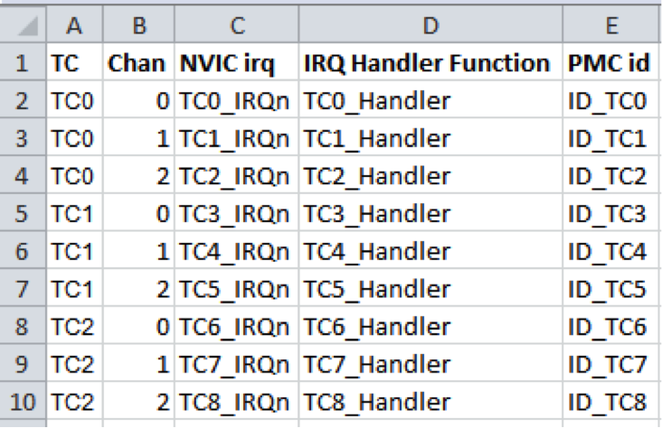
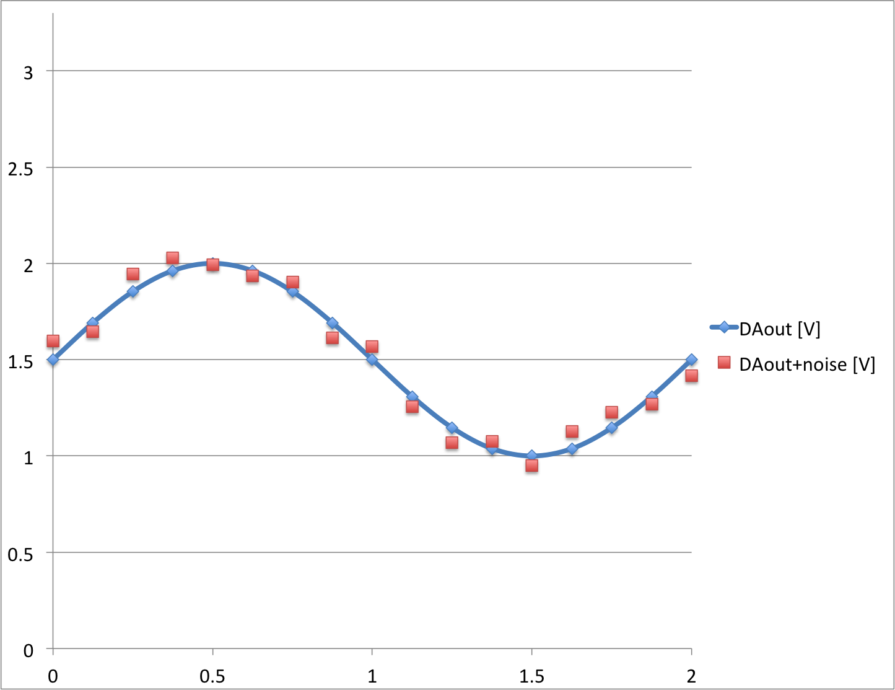
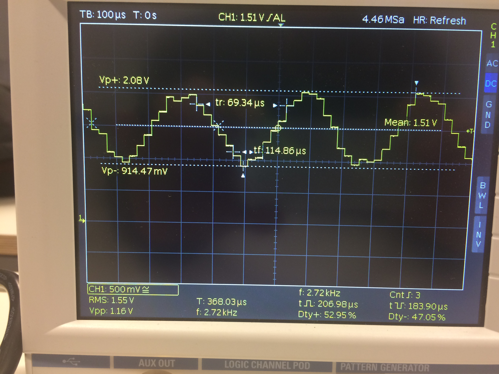
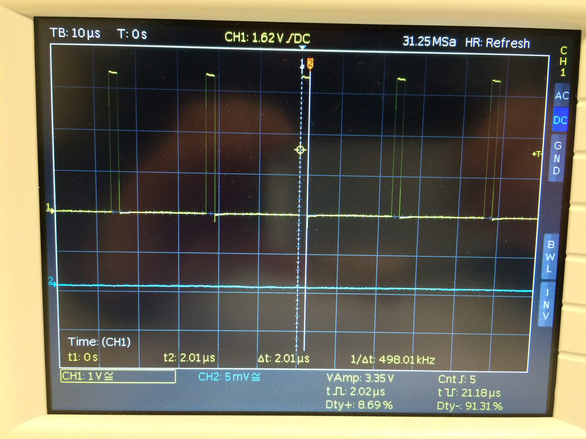
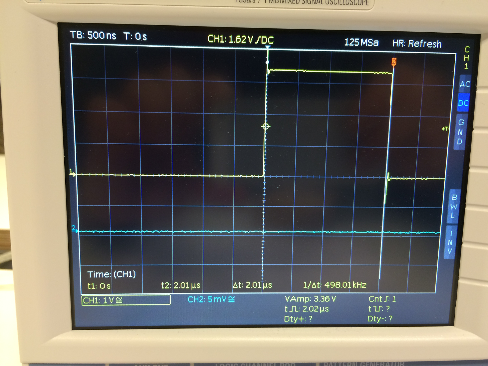
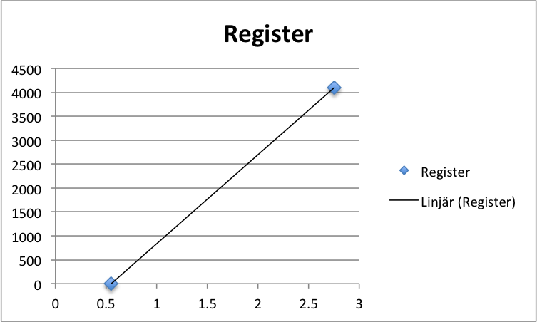

Uppgift 1501g
======

Programmeringslaboration med interrupts.

_All kod innehåller buggar och som vanligt finns det ingen garanti att koden som finns på labbens repo är felfri. Se det som en del av övningen att korrigera eventuella fel._

_Ulrik Eklund, 2015-12-17_

Syfte med uppgiften:
------

Studenten ska kunna programmera ett system som kan hantera olika saker samtidigt med hjälp av interrupts från Timer Counter. De olika funktionerna ska struktureras i olika c-filer och byggas till ett projekt.

Det färdiga programmet ska generera en sinusvåg med brus som skickas ut på D/A-utgången där frekvensen på sinusvågen blir ett resultat av frekvensen på det timer-interrupt som används. Det blir alltså en omvänd funktion jämfört med kommande laborationer som gäller signalbehandlingen.  
Parallellt med att generera sinusvågen ska den inbyggda lysdioden på Due-kortet blinka.

**Du kommer inte att hinna göra klart labben om du inte i förväg har börjat fundera på hur det ska gå till och redan har en plan när du kommer till labbsalen.**

Krav för godkänt:
------
Ha genomfört följande labbmoment enligt denna handledning:

1.	Skapa ett eget lokalt repository baserat på det gemensamma repot på github som finns för uppgiften.
2.	Starta Atmel Studio, modifiera källkoden i projektet genom att skapa ett timer-baserat interrupt.
3.	Utveckla och inkludera moduler till ett färdigt program som gör flera saker ”samtidigt”.
4.	Kompilera och ladda ner den till utvecklingskortet och köra programmet. 
5. Logga output från D/A-omvandlaren med oscilloskopet.
6.	Committa filerna till ditt personliga repo, synka med github, och göra en ”pull request” till det centrala kursrepot.

Läraren kommer att kolla alla pull requests vid veckans slut, om du lämnar in senare kommer uppgiften att bedömas vid kursens slut i mars.

Lämpliga förberedelser
------

1.	Labben kommer att innehålla grundläggande C-programmering, så repetera vad som gåtts igenom tidigare i kursen och i kursen datateknik från första året. Det finns ett diagnostiskt test på It’s learning. Gör det innan du går till labbsalen som en koll på att du kan grunderna!

2.	Läs igenom grunderna i versionshantering med git, t.ex. denna självstudiekurs: http://try.github.io/levels/1/challenges/1 

3.	Du skall också ha läst igenom hela denna handledning innan du går till labbsalen! Stora delar av programmet går att skriva utan att ha tillgång till någon utrustning då en av sakerna är att se till att alla inkluderade filer passar ihop och kan kompileras.

Förutsättningar för att kunna börja på uppgiften
------
1.	Om annan dator än labbsalens dator används (t.ex. egen dator) måste följande program finnas installerat på den datorn:
	- Atmel Studio 6.1 eller senare. Om Atmel studio 7 används så är det inte bakåtkompatibelt med en version som finns på datorerna i labbsalen
	- Bossac flashprogrammeringsdriver, inklusive DOS-macro (finns om man laddar ner uppgiftens repo)
	- En Git-klient, t.ex. Github client  eller TortoiseGit  (för andra operativsystem än Windows finns andra Git-klienter)

2.	Alla studenter i labbgruppen måste också ha registrerat en användare på github! 

Själva uppgiften
------
Labben bygger på att sätta samman både nya och tidigare testade c/h-filer till ett fungerande program som gör ett några saker parallellt:

- Blinkar lysdioden med 0,67 Hz (dvs en cykel av tänd/släckt tar 1,5s). Använd de funktioner som du programmerat i första labben; `pinMode()` och `digitalWrite()` tillsammans med `delayMicrosconds()`från den tredje labben.

- Skriver ett värde på AD-utgången med ett interrupt med en mycket högre frekvens än SOS-cykeln.

### Skapa ett personligt repo för denna programmeringsuppgift med hjälp av Git.  

Det finns ett centralt repo för kursen på github med webbadressen: 
<https://github.com/MalmoUniversity-DA264A/Task1501g> 

Du gör en fork från detta repot, och klonar det till din utvecklingsdator på samma sätt som i tidigare labbar. Sen jobbar  du vidare i ditt eget repo och gör en pull request mot kursrepot när du är klar.

Bygga labbsetup
------
Utrustning:

- Utvecklingskort Arduino Due
- Oscilloskop
	- Kabel för att kunna mäta på en utgång på Due-kortet med oscilloskopet.


Programmering
------

Föreslagen arbetsgång (committa gärna när du tycker att det är bra att spara fungerande steg):

1.	Öppna projektet i Atmel Studio i ditt lokala git repo.

2.	Kopiera in lämpliga delar från tidigare labbar för att få lysdioden att blinka periodiskt
	-  Filerna `digitalIO.h` och `digitalIO.c` från en första labben med funktionerna
	  
	```c
	void pinMode(int pinNumber, mode_definition mode);
	void digitalWrite(int pinNumber, int value);
	```
	
	-  Filerna `DelayFunctions.h` och `DelayFunctions.c` (finns redan i projektet) med funktionerna

		```c
	int delayInit(void);
	void delayMicroseconds(uint32_t us);
	```

3.	Skriv de c/h-filer som initialiserar D/A-omvandlaren.

4.	Skapa nödvändiga filer som initierar en timer-counter och låt den styra ett interrupt med en viss frekvens, för att åstadkomma en sinusvåg på oscilloskopet med en viss frekvens.

5. Skriv koden för själva interrupt-handlern.

6. Kör koden på kortet och mät resultatet med oscilloskopet.

7.	Committa projektet till din lokala rep i git.
 
8.	Gör en pull request på dina senaste commits till github (se nedan).


Saker att tänka på
------
Det finns ingen garanti att de filer som Ulrik har inkluderat i git är felfria. Säkrast är ju att använda den kod du själv tagit fram och testat i tidigare labbar.

### Atmel Software Framework
Använd ASF Wizard för att inkludera nödvändiga filer, t.ex. för D/A-omvandlare, timer counter, slumptalsgeneratorn och seriekommunikation via USB-kabeln.  
Ta också med `#include ”asf.h”` i alla filer det behövs efteråt.

### Initialisering av Due-kortet
För att programmet ska exekvera bör följande inkluderas i början på int main(void):

```c
/* Initialize the Arduino Due system */
sysclk_init();
board_init();
```

### Timer-kanaler
Delay-funktionen `delayMicroseconds(int us)` använder TC0. Eftersom Delay och ISR-funktionen använder sig av olika klockor som nollställs vid olika tillfällen kan man inte använda samma till båda!  
Antingen behåller du fördröjningen som den är, med TC0, eller så modifierar du den så att timer-interruptet kan använda sig av TC0. 
 
Oavsett vilken klocka och timer-kanal du använder till vad kan det hjälpa att läsa igenom förklaringen hur klockorna förhåller sig  timer-kanalerna och ISR på <http://ko7m.blogspot.se/2015/01/arduino-due-timers-part-1.html>  
Den viktigaste informationen är följande tabell:


Observera att man måste använda ASF Wizard under ASF menyn för att inkludera Atmels bibliotek för timern (TC) för att dessa ska fungera. **Om du använder en gammal version av ASF måste du nog ersätta funktionen `tc_read_cv(TC0,0)` med `tc_read_ra(TC0,0)` i filen `delayFunctions.c`.**


### Timer-baserat interrupt

Skriv c/h-filer för en ISR som skriver ett värde på D/A-utgången baserat på en array + genererat brus.
 
Om du använder timer counter 0 för avbrottet är det en funktion void `TC0_Handler(void)` (går att lägga i `main.c`). Om du använder en annan timer-kanal måste du använda en annat namn på funktionen. _Atmel studio håller automatiskt reda på att funktionen med namnet `TC0_Handler()`är ISR för timer counter 0._

### Generera en sinusvåg

Nedan finns en tabell med 16 element, som är en diskretisering av en hel period av en sinusvåg med amplituden 1 runt 0. Den kan ligga till grund för att generera en sinusvåg. Enklast är att skapa en array där varje element baseras på denne tabell, fast skalat till rätt amplitud och medelvärde.

index | x [rad] | sin(x)
--- | ---| ---
0 | 0 | 0,000
1 | 0,125 | 0,383
2 | 0,25 | 0,707
3 | 0,375 | 0,924
4 | 0,5 | 1,000
5 | 0,625 | 0,924
6 | 0,75 | 0,707
7 | 0,875 | 0,383
8 | 1 | 0,000
9 | 1,125 | -0,383
10 | 1,25 | -0,707
11 | 1,375 | -0,924
12 | 1,5 | -1,000
13 | 1,625 | -0,924
14 | 1,75 | -0,707
15 | 1,875 | -0,383

Om man har ett interrupt som skriver ut nästa värde från arrayen varje gång ett timer-baserat intererupt exekveras så kommer det att bli en sinusformad signal på A/D-utgången med frekvensen 1/16 av interruptets frekvens. Efter index 15 så börjar man förstås om på index 0.

Du skall generera en sinusvåg där frekvensen ges av de sex första siffrorna i ditt personnummer enligt följande formel:

```c
freq = (persNumber % 1979) + 1013;
```

Är du alltså född 850808 får du frekvensen _2830 Hz._

Du kan enkelt räkna ut hur ofta du måste anropa interrupt-handlern för att få rätt frekvens. Vektorn innehåller ju 16 värden för en hel svängning.

### D/A-utgången 

Låt utsignalen variera runt 1,5V på A/D-utgången (3,3/2 = _1,65V_) med en amplitud på 0,5V, det innebär att utspänningen variera mellan 1 och 2V enligt bilden nedan.  
Du måste ju såklart räkna ut hur många bitar detta motsvarar när du tagit reda på upplösningen på D/A-omvandlaren (se appendix).  



**Tänk också på att D/A-omvandlaren har ett arbetsområde som ges av _Table 45-44. Analog Outputs_ i databladet för SMA3X8E!** 0 respektive maxvärdet till registret på D/A omvandlaren ger alltså _inte_ 0V respektive 3,3V ut.  
_Vilket är den minsta respektive största spänningen du kan få från D/A-utgången?_
 
Välj själv hur du vill beräkna värdet till D/A-omvandlaren i interruptet. Det kan t.ex. göras med flyttal i ISR eller så gör du beräkningarna innan du skriver kod så att all kod använder sig enbart av heltal.

Den första lösningen är ju enklare att förstå om någon läser koden, men den andra går ju mycket snabbare.
Du skriver värdet till D/A-omvandlaren med hjälp av `dacc_write_conversion_data(uint32_t)`.


### Slumptalsgenerator för att generera brus

Atmel-processorn har en inbyggd slumptalsgenerator, som kan generera ett nytt 32-bitars slumptal var 84:e klockcykel. Använd den för att addera brus till sinusvågen innan den styr ut D/A-utgången.  
Bruset skall variera mellan -0,1V och +0,1V och adderas i interruptet till varje värde ifrån sinustabellen innan det skrivs till D/A-omvandlaren.  
Du kan på samma sätt räkna ut i förväg hur mycket det motsvarar i bitar för A/D-omvandlaren och därmed slippa flyttalsberäkningar i interrupt-handlern.

Du behöver i huvudsak två funktioner för att kunna använda slumptalsgeneratorn, se <http://asf.atmel.com/docs/latest/sam3x/html/group__group__sam__drivers__trng.html>

```c
void trng_enable(Trng *p_trng); /* Görs vid initiering */
uint32_t trng_read_output_data(Trng *p_trng); /* Läs 32-bitars slumptal */
```

Argumentet till båda funktionerna `TRNG` anger instansen och finns redan som en `#define` i ASF.


### Power magagent av externa devices

Både D/A-omvandlaren, timern och slumptalsgeneratorn går på en extern klocka jämfört med processorns huvudklocka. SAM3X8e aktiverar dessa bara då man säger till för att inte använda mer energi än nödvändigt, därför måste respektive klocka aktiveras när man ska programmet:

```c
pmc_enable_periph_clk(ID_TC0); /*Enable timer clock 0 */
pmc_enable_periph_clk(ID_DACC); /* Enable DA converter clock */
pmc_enable_periph_clk(ID_TRNG); /* Enable true number generator clock */
```


### Watchdog timer (WDT)

Följande är hämtat från databladet för SAM3X8E:

> The Watchdog Timer (WDT) can be used to prevent system lock-up if the software becomes trapped in a deadlock. It restarts with initial values on processor reset.   
> After a Processor Reset, the value of WDV is 0xFFF, corresponding to the maximum value of the counter with the external reset generation enabled. **This means that a default Watchdog is running at reset, i.e., at power-up.** The user must either disable it if he does not expect to use it or must reprogram it to meet the maximum Watchdog period the application requires.   
> In normal operation, the user reloads the Watchdog at regular intervals before the timer underflow occurs, by writing the Control Register.

I klartext betyder det att om man inte gör något åt det så kommer processorn att göra en reset efter ett tag då WDT har räknat ner till noll. Om man inte behöver funktionen att detektera och förhindra låsning av programmet så kan man avaktivera WDT med följande funktion från ASF i början av sitt program: 

```c
void wdt_disable(void);
```

För enkelhets skull har Atmel tänkt på det här. När man skapar ett nytt Due-projekt så får man en `main()` med två funktioner:

```c
int main(void)
{
	// Insert system clock initialization code here (sysclk_init()).
	sysclk_init();
	board_init();

	// Insert application code here, after the board has been initialized.
}
```

Det första som händer i `board_init();` är att WDT disablas!


### Mätning

Du skall ju givetvis mäta med oscilloskop på D/A-utgången att ditt program fungerar som det ska. Oscilloskopen i labbsalen har dessutom förmågan att spara mätningen som en bild, vilket du ska göra och inkludera i inlämningen i katalog `Results`. Eller så tar du helt enkelt en bild med mobilen. Har man gjort rätt ser det ut ungefär som nedan för ett enkelt svep:


Tänk på att det måste synas i din bild vilken frekvens och amplitud som din kurva på oscilloskopet har.  

### Utskrift

Vill man skriva ut något på konsolen via USB-kabeln måste den initieras. Kod finns i git

```c
/* Initialize the console UART used from within Atmel Studio*/
configure_console();
```

De här funktionerna använder sig av en funktion som bara finns med i senare versioner av ASF. Tänk också på att du måste konfigurera rätt parametrar i `src/config/conf_uart_serial.h` för att kommunicera med terminalfönstret, enklast är att ta bort kommentarstecknen för tre rader.


Tävlingsdags!
------

_Om du vill kan du delta i kursens programmeringstävling. Det är frivilligt och påverkar inte om du blir godkänd eller inte. Men du kan vinna ett fint pris..._

Tävlingen går ut på vem som kan skriva den mest effektiva interrupt-handlern (`TC_handler()`), dvs den handler som tar kortast tid på sig att räkna ut rätt värde på sinuskurvan+brus och lägga ut det på D/A-omvandlaren. med rätt frekvens.

Det är redan förberett att delta i tävlingen genom att två pinnar i början av `main()` är initierade som en digitala utgångar. Dessa använder sig av de funktioner som du skrev i lab 1501a.

```c
pinMode(13, OUTPUT); /* Initialise pin 13 on the Due as an output */
pinMode(22, OUTPUT); /* Initialise pin 22 on the Due as an output */
```

I din interrupt-handler skall du sen ha med följande kod för att styra utgången på Due-pinne 22.

```c
void TC_Handler(void)
{
	digitalWrite(22, 1);
	/* Definitions of needed variables go here*/
	
	/* 
	 * Here goes the rest of the ISR code,
	 * including writing to the DACC 
	 */
	digitalWrite(22, 0);
}
```

Det gör att du kan koppla oscilloskopet till pinne 22 på Due-kortet och mäta hur lång tid TC-handlern tar för att exekvera. Då ser pulserna ut som nedan.



Spara alla bilder i katalogen `Results`, med en mätning av hur lång pulsen är med hjälp av oscilloskopets cursor, och skicka in som ditt tävlingsbidrag. Ange också i din git-commit vilken tid du har mätt upp.  
Ulrik har lagt upp exempel på en mätning i resultatkatalogen, se nedan, men förhoppningsvis kan du göra handlern snabbare än 2,01 us!



_Deadline för att vara med och tävla om priset är fredag 17:00 samma vecka som ordinarie labbtilfälle! Du får uppdaterat din pull request hur många gånger du vill, men undvik att skapa nya._

### Några tips för att optimera sin kod

Det finns några utmaningar som du måste lösa för att skriva en effektiv handler:

- Att räkna om amplituden för sinusvågen i tabellen till vettiga värden som går att skriva till DACC-registret (skalade till 10 eller 12 bitar).

- Att skala om slumptalet på 32 bitar till ett tillräckligt litet tal som kan adderas till sinusvågen.

- Att se till att utspänningen verkligen varierar precis mellan 1 och 2V utan komplicerade beräkningar.

- Flyttalsberäkningar tar lång tid, ca 5 ggr så lång tid som heltalsberäkningar. Ju fler beräkningar du kan göra _utanför_ TC-handlern desto snabbare blir den.

- Du kan spara ytterligare lite tid genom att effektivisera funktionen `digitalWrite()` som du skrev i lab 1501a. Den måste såklart ändå klara av att styra både utgång 13 och 22 oberoende av varandra på Due-kortet.


Inlämning
------

Om du är klar med all programmering är det vara dags att synka ditt lokala repo med det som du har på github. Det görs med en push tillbaka till github. Din gitklient är oftast så smart att den kommer ihåg varifrån man klonade repot, därför kan man oftast använda origin istället för den långa webbaddressen (<https://github.com/StudentNN/Task1501g.git>. 

Har du kommit så långt att du har ett uppdaterat repo som du kan se på githubs webbsida kan du skicka in en begäran att ägaren till det gemensamma kursrepot ska titta på dina ändringar genom en pull request. Där anger du en rubrik (till exempel att du är klar med en viss uppgift), och fyller i en beskrivning av vad dina ändringar består av.

**Glöm inte att ange namnen alla som bidragit med att göra klart uppgiften!** Det går inte att komma i efterhand och påstå att du varit med om ditt namn inte finns med på originalinlämningen! I så fall får du göra en egen pull request efteråt.

Ulrik kommer att titta på alla som har lämnat in till fredag. Om du lämnar in senare kommer de att bedömas vid kursens slut.


Appendix - Initiering av digital-to-analog converter
======

```c
int daccInit()
{
	int allOK = 1;
	pmc_enable_periph_clk(ID_DACC); /* DACC clock should be enabled before using it. */
	dacc_reset(DACC); /* Reset DACC */
	dacc_set_transfer_mode(DACC, 0); /* Configure FIFO transfer mode */
	dacc_set_timing(DACC,1,1,0); /* 1 is shortest refresh period, 1 max. speed, 0 startup time */
	dacc_set_channel_selection(DACC,0); /* Disable flexible (TAG) mode and select channel 0 for DAC output */
	allOK = dacc_enable_channel(DACC, 0); /* Enable DAC channel 0 */
	return allOK;
}
```

Efter initialiseringen så kan man ändra utspänningen med ett enda funktionsanrop i ASF:

```c
uint32_t value;
dacc_write_conversion_data(DACC, value);
```


Appendix - Rätt spänning på D/A-utgången
======
D/A-omvandlaren har ett arbetsområde mellan `(1/6)*V_ADVREF`och `(5/6)*V_ADVREF`. Med 12 bitars upplösning så innebär det att skriver man `0x00000000` till registret får man ut den lägre spänningen och skriver man `0x00000FFF` (= 4095 decimalt) får man den högre spänningen. Däremellan är det ett linjärt samband.

Då är det rätt lätt att hitta en formel av typen `Reg = k*V + b` för att bestämma vilket registervärde (Reg) som behövs för att ge en viss spänning (V).


Eftersom man vet spännings- och registervärdet för två punkter, (V0,Reg0) respektive (V1,Reg1), är det lätt att räkna ut k och b (grundläggande matte!)

`k = (Reg1-Reg0)/(V1-V0)`

`b = Reg0 - k*V0`

